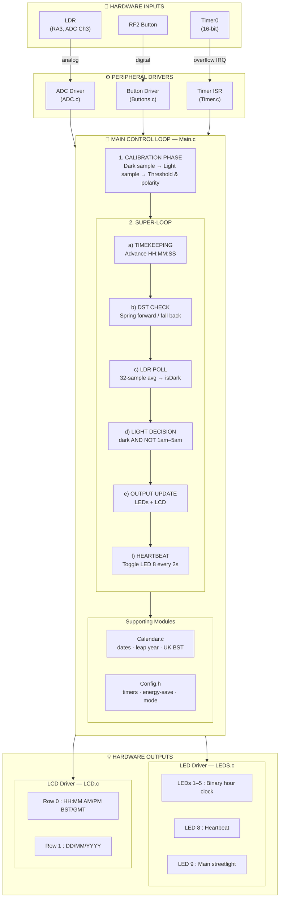

# EMS700U_Code
This code was made for a brain subregion segmentation pipeline with integrated spatial analysis.

# Control Architecture

# Control Architecture

```mermaid
flowchart TD
    subgraph INPUTS["🔌 HARDWARE INPUTS"]
        LDR["LDR\n(RA3, ADC Ch3)"]
        BTN["RF2 Button"]
        TMR["Timer0\n(16-bit)"]
    end

    LDR -->|"analog"| ADC
    BTN -->|"digital"| BUTTON
    TMR -->|"overflow IRQ"| TIMER

    subgraph DRIVERS["⚙️ PERIPHERAL DRIVERS"]
        ADC["ADC Driver\n(ADC.c)"]
        BUTTON["Button Driver\n(Buttons.c)"]
        TIMER["Timer ISR\n(Timer.c)"]
    end

    ADC --> MAIN
    BUTTON --> MAIN
    TIMER --> MAIN

    subgraph MAIN["🔁 MAIN CONTROL LOOP — Main.c"]
        direction TB
        CAL["1. CALIBRATION PHASE\nDark sample → Light sample → Threshold & polarity"]
        CAL --> LOOP

        subgraph LOOP["2. SUPER-LOOP"]
            direction TB
            A["a) TIMEKEEPING\nAdvance HH:MM:SS"]
            B["b) DST CHECK\nSpring forward / fall back"]
            C["c) LDR POLL\n32-sample avg → isDark"]
            D["d) LIGHT DECISION\ndark AND NOT 1am–5am"]
            E["e) OUTPUT UPDATE\nLEDs + LCD"]
            F["f) HEARTBEAT\nToggle LED 8 every 2s"]
            A --> B --> C --> D --> E --> F
        end

        LOOP --> SUP
        subgraph SUP["Supporting Modules"]
            CAL_MOD["Calendar.c\ndates · leap year · UK BST"]
            CFG["Config.h\ntimers · energy-save · mode"]
        end
    end

    MAIN --> LEDS_DRV
    MAIN --> LCD_DRV

    subgraph OUTPUTS["💡 HARDWARE OUTPUTS"]
        subgraph LEDS_DRV["LED Driver — LEDS.c"]
            L1["LEDs 1–5 : Binary hour clock"]
            L2["LED 8 : Heartbeat"]
            L3["LED 9 : Main streetlight"]
        end
        subgraph LCD_DRV["LCD Driver — LCD.c"]
            R0["Row 0 : HH:MM AM/PM BST/GMT"]
            R1["Row 1 : DD/MM/YYYY"]
        end
    end
```
